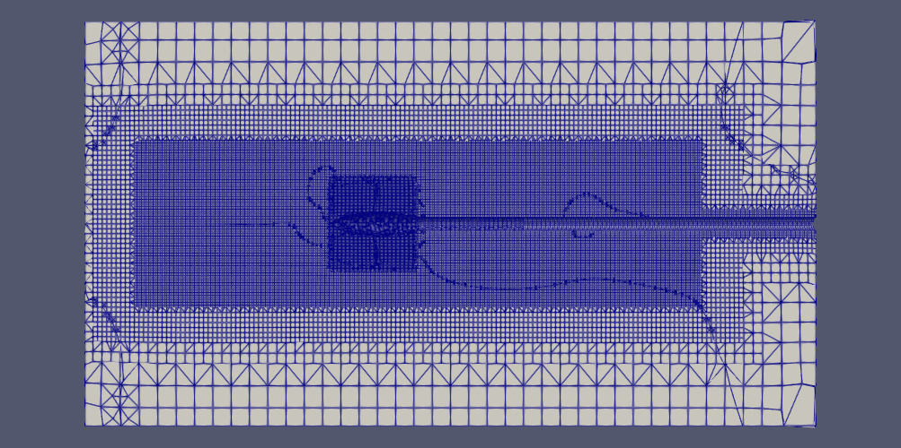
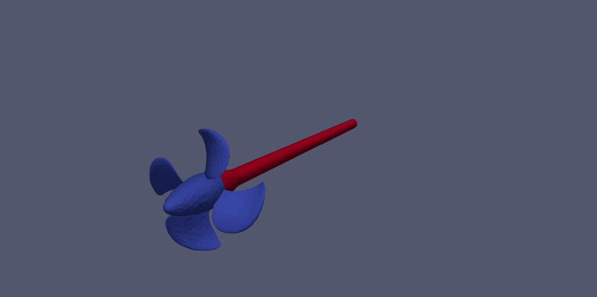

# parametric-propeller-mesh
This package simplifies the configuration of an OpenFOAM mesh  as a function of
the dimension of a propeller. It creates an arbitrary number of cylinders (in
`.obj` files)to define different regions of refinement, as well as the
configuration dictionaries for OpenFOAM tools (i.e. `snappy`).

## Results

The following image shows the result after the application of `snappy` with
4 cylinders with refinement values varying from 5 (innermost) to 3
(`cylinder2`).



## Installation and usage
Download the source code using the command

```
https://github.com/fAndreuzzi/parametric-propeller-mesh.git
```

Then navigate to the directory downloaded. To use the package use the following
command from your terminal:

```
python3 script.py your/OpenFOAM/case/directory your/propeller.obj
```

`your/OpenFOAM/case/directory` is the root directory of your OpenFOAM
experiment, the one which contains the directories `constant`, `system`, etc.
`your/propeller.obj` is an OBJ file which contain the 3D representation of
your propeller divided in two regions `propellerTip` and `propellerStem`. In
order to generate such an `.obj` file you may be interested in the method
`propeller.Propeller.generate_obj` from the package
[BladeX](https://github.com/fAndreuzzi/BladeX) (at the moment available only
in my fork of the project).



## Configuration

At the moment you need to modify the script in order to change the
configuration. We are going to switch to another method as soon as the
complexity increases.

+ `N_of_cylinders`: The number of cylinders used to define different regions
  of resolution (every cylinder encloses one region);
+ `cylinder_scales`: A `N x 3` (where `N` is `N_of_cylinders`). Every column
  is the dimension of the corresponding cylinder on that axis, in terms of
  propeller diameters (`[2, 1, 2]` means that the cylinder is two diameters big
  along X and Z, and one diameter big along Y);
+ `take_available_y`: The amount of Y available space that a cylinder can take
  in the direction of the propellerTip. For details see the documentation of the
  function `src.generate_cylinders.compute_cylinder_anchors`. Must contain
  `N-1` items (where `N` is `N_of_cylinders`) since the outermost cylinder is
  already anchored to the tail of `propellerStem`.

Important: cylinders appear always in increasing dimension. This means that
the first row of `cylinder_scales` represents the innermost cylinder, and the
last one the outermost. Cylinders must not overlap, intersect, or do other weird
things.
